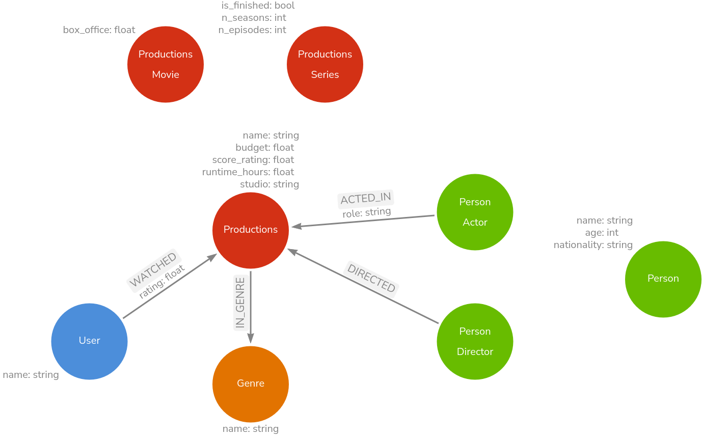
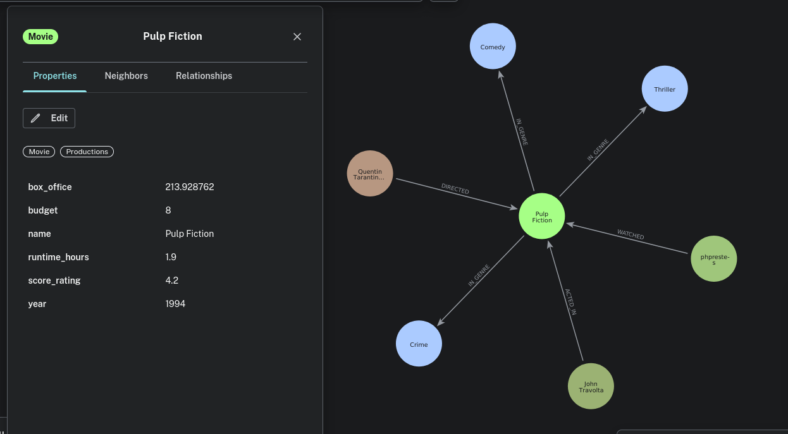

# Neo4j - Análise de Dados com Grafos
## Projeto 1 - Modelagem de Dados em Grafos de um Serviço de Streaming
### **Enunciado**
Você foi contratado por um novo serviço de streaming de filmes e séries e sua primeira tarefa é projetar o banco de dados. Diferente dos sistemas tradicionais, a empresa quer focar nos relacionamentos para criar um sistema de recomendação poderoso.

### **Resolução**
Seguindo os critérios de entidades e relacionamentos descritos no enunciado completo e adaptando-o para admitir hierarquia entre tipos de nó, podemos obter a seguinte arquitetura:

   

Esse diagrama foi desenvolvido no [arrows.app](https://arrows.app) e o arquivo JSON gerado está disponível na pasta do projeto.

Há diversas aberturas para melhorias nessa arquitetura, principalmente nas propriedades dos nós e arestas. Entretanto, como o projeto é voltado para o entendimento da modelagem conceitual de entidades e suas ligações, as propriedades não são a parte principal e foram colocadas no diagrama meramente para ilustração e exemplificação. Segue como ficaria um grafo seguindo esse modelo dentro do Neo4j Bloom:

A query usada para criar esse exemplo também está disponível na pasta desse projeto.